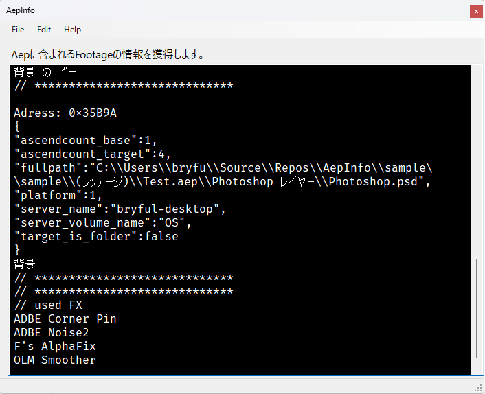

# AepInfo

 
 
aepファイルを読み込んでフッテージの情報を出力します。 
まだテスト段階なのでよく分からないけどとりあえず表示出来る物を表示させてます。 
 
連番のpsdのレイヤとかまだ調べていないのでおかしくなると思います。 
 
aepは基本的にはRIFF形式のバイナリーなので、Chunk解析を真面目にやればなんとかなりそうですが、
面倒の一言なので必要なところだけ適当にやってます。 
下のリファレンスにあるHPで解析は出来るのですがやる気出ません。とりあえずフッテージの一覧・使用しているプラグイン一覧・使用しているフォントの一覧を目標にやってます。 

* [AepInfo_v000.zip](http://bit.ly/3loK1zt) ベータ版

 
# 使い方
 AepファイルをウィンドウにD&Dしてください。読み込んで出力します。

# Dependency
Visual studio 2022 C# 

# References
[https://github.com/boltframe/aftereffects-aep-parser](https://github.com/boltframe/aftereffects-aep-parser) 
[https://ide.kaitai.io/](https://ide.kaitai.io/) 
[https://en.wikipedia.org/wiki/Resource_Interchange_File_Format#Explanation](https://en.wikipedia.org/wiki/Resource_Interchange_File_Format#Explanation)
# License

This software is released under the MIT License, see LICENSE

# Authors

bry-ful(Hiroshi Furuhashi) 
twitter:bryful 
bryful@gmail.com 

